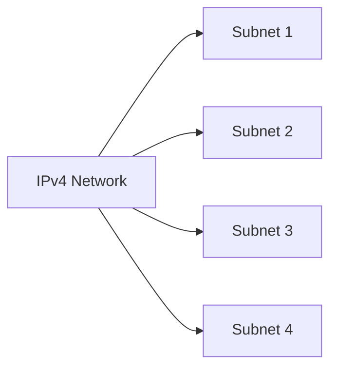

# Subnetting Using Classes and CIDR

## Introduction

Subnetting is the process of dividing a large IP network into smaller, manageable networks called **subnets**. Traditionally, IPv4 networks used **Classful Addressing (Classes A, B, and C)**. Today, most networks use **CIDR (Classless Inter-Domain Routing)**, which provides greater flexibility and efficient IP address allocation.

---

## Why This Topic Matters

Understanding subnetting helps you:

- Design efficient networks
- Reduce IP address waste
- Improve network performance
- Enhance network security through segmentation
- Analyze networks during penetration testing

---

## Learning Objectives

After studying this topic, you should be able to:

- Explain IPv4 address classes
- Understand subnet masks and CIDR notation
- Calculate basic subnets
- Identify network and broadcast addresses
- Determine usable host ranges

---

## Key Concepts

### IPv4 Address

An IPv4 address consists of **32 bits**, divided into four octets.

Example:

```
192.168.1.10
```

---

### Classful Addressing

| Class | First Octet Range | Default Mask | CIDR | Hosts per Network |
|--------|-------------------|--------------|------|-------------------|
| A | 1–126 | 255.0.0.0 | /8 | 16,777,214 |
| B | 128–191 | 255.255.0.0 | /16 | 65,534 |
| C | 192–223 | 255.255.255.0 | /24 | 254 |

> **Note**
>
> Class D (224–239) is used for multicast, and Class E (240–255) is reserved for experimental purposes.

---

### Subnet Mask

A subnet mask separates the **network portion** from the **host portion** of an IP address.

Example:

```
IP Address : 192.168.1.25
Subnet Mask: 255.255.255.0
CIDR       : /24
```

---

### CIDR (Classless Inter-Domain Routing)

CIDR replaces fixed address classes with **prefix lengths**.

Examples:

| CIDR | Subnet Mask |
|------|-------------|
| /24 | 255.255.255.0 |
| /25 | 255.255.255.128 |
| /26 | 255.255.255.192 |
| /27 | 255.255.255.224 |
| /28 | 255.255.255.240 |
| /29 | 255.255.255.248 |
| /30 | 255.255.255.252 |

CIDR allows networks of different sizes instead of relying on fixed classes.

---

## Short Explanation

Classful networking assigns fixed subnet masks based on the IP address class, which often wastes IP addresses.

CIDR allows administrators to choose the exact subnet size needed, making IP allocation much more efficient.

---

## Mermaid Diagram



---

## Practical Examples

### Example 1: Class C Network

Network:

```
192.168.1.0/24
```

- Network Address: 192.168.1.0
- First Host: 192.168.1.1
- Last Host: 192.168.1.254
- Broadcast Address: 192.168.1.255
- Usable Hosts: 254

---

### Example 2: CIDR /26

Network:

```
192.168.1.0/26
```

Subnet Size:

64 addresses

Network:

192.168.1.0

Broadcast:

192.168.1.63

Usable Hosts:

192.168.1.1 – 192.168.1.62

Total Usable Hosts:

62

---

### Example 3: Dividing a /24 into Four Equal Subnets

```
192.168.1.0/24
```

Becomes:

| Subnet | Network | Broadcast |
|---------|----------|-----------|
| /26 | 192.168.1.0 | 192.168.1.63 |
| /26 | 192.168.1.64 | 192.168.1.127 |
| /26 | 192.168.1.128 | 192.168.1.191 |
| /26 | 192.168.1.192 | 192.168.1.255 |

---

## Commands

### Show IP Configuration (Linux)

```bash
ip addr
```

Displays network interfaces and IP addresses.

---

### Show Routing Table

```bash
ip route
```

Displays network routes.

---

### Show Interface Information

```bash
ifconfig
```

> **Tip**
>
> Modern Linux systems prefer `ip addr` over `ifconfig`.

---

## Best Practices

- Use CIDR instead of classful addressing.
- Allocate only the required number of IP addresses.
- Document subnet assignments.
- Reserve IP addresses for infrastructure devices.
- Plan future network growth before subnetting.

---

## Common Mistakes

- Confusing network and broadcast addresses.
- Assigning network or broadcast addresses to hosts.
- Choosing subnet masks that are too large or too small.
- Forgetting that two addresses in each subnet are reserved (except special cases like /31).

---

## Summary

Subnetting divides networks into smaller segments to improve efficiency, security, and management. While classful addressing introduced fixed network sizes, CIDR provides flexible subnetting that minimizes wasted IP addresses and is the standard approach in modern networking.

---

## Key Takeaways

- IPv4 addresses contain 32 bits.
- Classful addressing uses fixed subnet masks.
- CIDR uses prefix lengths such as /24 or /26.
- Subnetting improves performance and security.
- CIDR is the preferred subnetting method today.

---

## Practice Questions

1. What is the difference between classful addressing and CIDR?
2. How many usable hosts are available in a /26 subnet?
3. What is the broadcast address of 192.168.10.0/27?
4. Why has CIDR replaced classful addressing?
5. What is the default subnet mask for a Class B network?

---

## Useful Resources

- RFC 4632 – Classless Inter-Domain Routing (CIDR)
- Cisco Networking Academy
- TryHackMe – Networking Fundamentals
- Nmap Documentation
- Wireshark Documentation

---

## Suggested Next Topic

**IPv4 Subnetting Calculations (Magic Number Method)**
