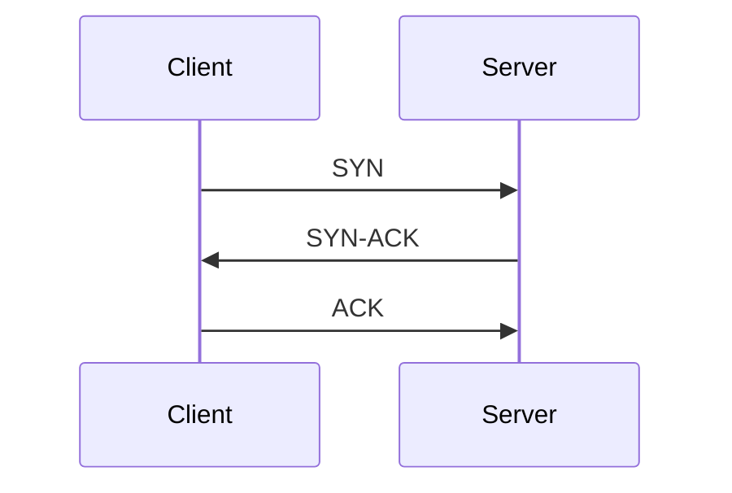

# TCP vs UDP

## Introduction

TCP (Transmission Control Protocol) and UDP (User Datagram Protocol) are two core transport layer protocols in the TCP/IP model. They enable communication between applications over a network but differ significantly in how they deliver data.

---

## Why This Topic Matters

Understanding TCP and UDP helps you:

- Analyze network traffic effectively
- Troubleshoot connectivity issues
- Understand how web applications and online services communicate
- Perform network security assessments
- Interpret packet captures in tools like Wireshark

---

## Learning Objectives

After studying this topic, you should be able to:

- Explain the purpose of TCP and UDP
- Compare TCP and UDP
- Identify common use cases
- Recognize important packet characteristics
- Choose the appropriate protocol for different scenarios

---

## Key Concepts

### TCP (Transmission Control Protocol)

- Connection-oriented protocol
- Reliable data delivery
- Guarantees packet order
- Performs error checking
- Uses acknowledgments (ACKs)
- Slower due to reliability features

### UDP (User Datagram Protocol)

- Connectionless protocol
- Faster communication
- No delivery guarantee
- No packet ordering
- Minimal overhead
- Suitable for real-time applications

---

## Short Explanation

Before sending data, TCP establishes a connection using the Three-Way Handshake. It tracks packets, retransmits lost data, and ensures information arrives correctly.

UDP sends packets without establishing a connection. Since it skips reliability checks, it provides lower latency and higher speed.

---

## Mermaid Diagram


---

## TCP Three-Way Handshake



---

## Practical Examples

### TCP

- Web browsing (HTTP/HTTPS)
- Email (SMTP, IMAP, POP3)
- File Transfer (FTP)
- SSH Remote Login

### UDP

- DNS Queries
- Online Gaming
- Voice over IP (VoIP)
- Video Streaming
- Live Broadcasting

---

## Common Ports

| Protocol | Common Port | Service |
|-----------|------------|---------|
| TCP | 80 | HTTP |
| TCP | 443 | HTTPS |
| TCP | 22 | SSH |
| TCP | 25 | SMTP |
| UDP | 53 | DNS |
| UDP | 67/68 | DHCP |
| UDP | 123 | NTP |

---

## Commands

### View Active TCP Connections

```bash
netstat -ant
```

Displays active TCP connections.

---

### View Listening Ports

```bash
ss -tuln
```

- `-t` TCP
- `-u` UDP
- `-l` Listening
- `-n` Numeric output

---

### Scan TCP Ports

```bash
nmap -sS 192.168.1.10
```

Performs a TCP SYN scan.

---

### Scan UDP Ports

```bash
nmap -sU 192.168.1.10
```

Scans UDP ports.

> **Note**
> UDP scanning is slower because many UDP services do not respond unless queried correctly.

---

## Best Practices

- Use TCP when reliability is critical.
- Use UDP for low-latency applications.
- Secure unnecessary open ports.
- Monitor unusual TCP and UDP traffic.
- Regularly scan systems for exposed services.

---

## Common Mistakes

- Assuming UDP is always faster for every application.
- Ignoring packet loss in UDP applications.
- Forgetting that TCP consumes more bandwidth due to acknowledgments.
- Exposing unnecessary network services.
- Misinterpreting UDP scans as closed ports.

---

## Summary

TCP focuses on reliable, ordered communication, making it suitable for applications where every packet matters. UDP prioritizes speed and low latency, making it ideal for real-time communication where occasional packet loss is acceptable.

---

## Key Takeaways

- TCP is reliable and connection-oriented.
- UDP is fast and connectionless.
- TCP guarantees delivery and ordering.
- UDP minimizes overhead.
- Ethical hackers frequently analyze both protocols during network assessments.

---

## Practice Questions

1. What is the main difference between TCP and UDP?
2. Why does TCP use the Three-Way Handshake?
3. Name three applications that commonly use UDP.
4. Which Nmap option scans UDP ports?
5. Why is TCP considered more reliable than UDP?

---

## Useful Resources

- RFC 793 (TCP)
- RFC 768 (UDP)
- Wireshark Documentation
- Nmap Documentation
- Cisco Networking Academy

---

