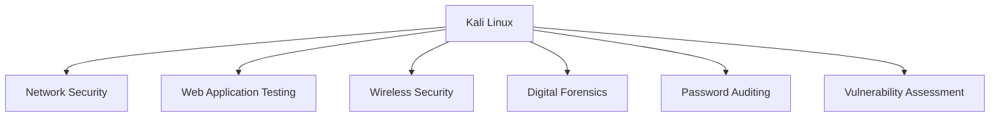

# Kali Linux Introduction

## Introduction

**Kali Linux** is a Debian-based Linux distribution designed specifically for **cybersecurity professionals**, **ethical hackers**, **penetration testers**, and **digital forensics investigators**. It comes pre-installed with hundreds of security tools for network analysis, vulnerability assessment, web application testing, wireless security, reverse engineering, and more.

Developed and maintained by **OffSec (Offensive Security)**, Kali Linux is one of the most widely used operating systems in the cybersecurity industry.

---

## Why This Topic Matters

Learning Kali Linux helps you:

- Build a professional ethical hacking environment
- Access industry-standard security tools
- Practice penetration testing legally
- Learn Linux command-line skills
- Prepare for cybersecurity certifications and real-world jobs

---

## Learning Objectives

After studying this topic, you should be able to:

- Explain what Kali Linux is
- Understand its primary use cases
- Identify its key features
- Install and update Kali Linux
- Navigate its desktop and terminal

---

## Key Concepts

### What is Kali Linux?

Kali Linux is a specialized Linux distribution optimized for cybersecurity tasks. Unlike general-purpose operating systems, it includes hundreds of security tools out of the box.

---

### Who Uses Kali Linux?

- Ethical Hackers
- Penetration Testers
- Security Researchers
- Digital Forensics Analysts
- Red Team Professionals
- Students learning cybersecurity

---

### Key Features

- Debian-based operating system
- Open-source and free
- Hundreds of pre-installed security tools
- Frequent updates
- Supports Virtual Machines
- Live Boot support
- ARM device support (e.g., Raspberry Pi)

---

### Popular Built-in Tools

| Tool | Purpose |
|-------|---------|
| Nmap | Network scanning |
| Wireshark | Packet analysis |
| Burp Suite Community | Web security testing |
| Metasploit Framework | Penetration testing |
| Hydra | Password auditing |
| John the Ripper | Password cracking |
| SQLMap | SQL Injection testing |
| Aircrack-ng | Wireless security testing |

---

## Short Explanation

Kali Linux provides a ready-to-use environment for cybersecurity professionals. Instead of installing security tools one by one, users can begin learning and practicing immediately after installation.

Although Kali includes powerful tools, they should only be used on systems you own or have explicit permission to test.

> **Warning**
>
> Never use Kali Linux tools against unauthorized systems. Ethical hacking always requires permission.

---

## Mermaid Diagram



---

## Practical Examples

### Example 1: Check Kali Version

```bash
cat /etc/os-release
```

Displays the installed Kali Linux version.

---

### Example 2: Update Package List

```bash
sudo apt update
```

Downloads the latest package information.

---

### Example 3: Upgrade Installed Packages

```bash
sudo apt full-upgrade -y
```

Updates installed software to the latest available versions.

---

### Example 4: Show Current User

```bash
whoami
```

Displays the currently logged-in user.

---

### Example 5: Display Current Directory

```bash
pwd
```

Shows the current working directory.

---

## Best Practices

- Keep Kali Linux updated.
- Use Kali inside a virtual machine for learning.
- Practice only in legal lab environments such as TryHackMe or Hack The Box.
- Learn Linux commands before advanced hacking tools.
- Document your learning and lab results.

> **Tip**
>
> Take snapshots of your virtual machine before major changes so you can restore it if needed.

---

## Common Mistakes

- Using Kali as a daily operating system without understanding Linux.
- Running tools against systems without authorization.
- Ignoring Linux fundamentals.
- Forgetting to update the system regularly.
- Relying on automated tools without understanding how they work.

---

## Summary

Kali Linux is a powerful, Debian-based operating system built for cybersecurity professionals. It provides hundreds of security tools, making it an excellent platform for learning ethical hacking, penetration testing, and digital forensics. Success with Kali Linux comes from understanding both Linux fundamentals and responsible, legal use of its tools.

---

## Key Takeaways

- Kali Linux is designed for cybersecurity and ethical hacking.
- It is free, open-source, and based on Debian.
- It includes hundreds of pre-installed security tools.
- Linux command-line knowledge is essential.
- Always use Kali legally and ethically.

---

## Practice Questions

1. What is Kali Linux, and who develops it?
2. Why is Kali Linux popular among ethical hackers?
3. Name five tools included with Kali Linux.
4. Why should Kali Linux be kept updated?
5. What is the importance of obtaining permission before using Kali Linux tools?

---

## Useful Resources

- Official Kali Linux Documentation
- OffSec Training
- TryHackMe – Linux Fundamentals
- Hack The Box Academy – Linux Basics
- Debian Documentation

---

## Suggested Next Topic

**Linux File System and Basic Terminal Commands**
