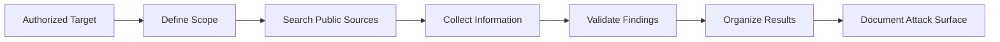

# Passive Reconnaissance

## Introduction

**Passive reconnaissance** is the process of collecting information about a target without directly interacting with its systems in a way that generates traffic to the target infrastructure.

Security professionals use publicly available information (OSINT) to understand an organization's digital footprint before performing an authorized security assessment.

> **Warning**
>
> Only research organizations, domains, and systems that you own or have explicit permission to assess. Passive does not automatically mean authorized.

---

## Why This Topic Matters

Passive reconnaissance helps security professionals:

- Understand an organization's public attack surface
- Discover publicly exposed information
- Identify technologies and infrastructure
- Gather information before an authorized assessment
- Reduce unnecessary interaction with target systems

---

## Learning Objectives

After studying this topic, you should be able to:

- Explain passive reconnaissance
- Distinguish passive and active reconnaissance
- Identify useful public information sources
- Perform basic OSINT research
- Document reconnaissance findings responsibly

---

## Key Concepts

### OSINT

**Open-Source Intelligence (OSINT)** is information collected from publicly available sources.

Examples include:

- Search engines
- Public websites
- DNS information
- Certificate transparency records
- Public code repositories
- Public documentation
- Security databases

### Passive vs Active Reconnaissance

| Passive | Active |
|---|---|
| Uses public information | Directly interacts with target |
| Usually generates little/no target traffic | Generates network requests |
| Lower risk of detection | More likely to be detected |
| Examples: search engines, CT logs | Examples: port scanning, service enumeration |

---

## Short Explanation

Suppose an organization owns:

```text
example.com
```

A passive researcher might search public sources for:

- Publicly documented subdomains
- Certificate records
- Technology information
- Public repositories
- DNS records available through third-party sources
- Publicly indexed documents

The researcher collects and organizes this information without actively scanning the organization's servers.

---

## Practical Examples

### 1. Search Engine Research

Use search engines to identify publicly indexed information.

Example:

```text
site:example.com
```

You can also search for publicly indexed document types:

```text
site:example.com filetype:pdf
```

Only use these techniques against authorized targets.

---

### 2. Certificate Transparency

Certificate Transparency logs can reveal domain names that have appeared in publicly issued TLS certificates.

Useful resource:

```text
https://crt.sh/
```

Search for an authorized domain such as:

```text
example.com
```

---

### 3. WHOIS Information

WHOIS/RDAP services can provide registration information for domains, although privacy protections often hide personal information.

Example resource:

```text
https://lookup.icann.org/
```

---

### 4. DNS Information

Public DNS information can help identify records such as:

- A
- AAAA
- MX
- NS
- TXT

For example:

```bash
dig example.com
```

> **Note**
>
> A direct DNS query technically interacts with DNS infrastructure. Treat the exact technique and scope according to your authorization and assessment rules.

---

### 5. Public Code Repositories

Public repositories may reveal:

- Technology stacks
- Documentation
- Developer information
- Public configuration examples
- Historical project information

Never attempt to access private repositories or credentials.

---

## Passive Reconnaissance Workflow



---

## Useful Tools and Resources

| Resource | Purpose |
|---|---|
| Google/Bing | Search-engine research |
| crt.sh | Certificate Transparency |
| ICANN Lookup | Domain registration information |
| SecurityTrails | DNS and infrastructure intelligence |
| Shodan | Publicly indexed internet-facing services |
| GitHub | Public code and documentation |
| theHarvester | OSINT collection |
| Maltego | Relationship and OSINT visualization |

Use these only within an authorized scope.

---

## Commands/Code

### WHOIS

```bash
whois example.com
```

Queries publicly available domain registration information where supported.

### DNS Lookup

```bash
dig example.com
```

Queries DNS records.

### Reverse DNS

```bash
dig -x 8.8.8.8
```

Performs a reverse DNS lookup.

---

## Best Practices

- Define the authorized scope before collecting information.
- Prefer publicly available sources.
- Record the source and date of every finding.
- Verify important information using multiple sources.
- Avoid collecting unnecessary personal information.
- Never use discovered credentials.
- Keep reconnaissance reports organized.
- Respect applicable laws and terms of service.

> **Tip**
>
> Separate **facts** from **assumptions** in your notes. Record the source for every important finding.

---

## Common Mistakes

- Assuming every discovered subdomain belongs to the target organization.
- Treating search-engine results as automatically accurate.
- Performing active scans during a passive reconnaissance exercise.
- Collecting unnecessary personal information.
- Using leaked credentials instead of simply documenting their exposure.
- Failing to record where and when information was discovered.

---

## Summary

Passive reconnaissance is the information-gathering phase of an authorized security assessment that relies primarily on publicly available sources. It helps security professionals understand an organization's digital footprint before moving into more direct testing.

Strong passive reconnaissance combines search engines, certificate records, domain information, public repositories, DNS intelligence, and careful documentation.

---

## Key Takeaways

- Passive reconnaissance focuses on publicly available information.
- OSINT is an important part of passive reconnaissance.
- Passive and active reconnaissance are different activities.
- Always verify findings and document their sources.
- Authorization and scope are essential.

---

## Practice Questions

1. What is passive reconnaissance?
2. How is passive reconnaissance different from active reconnaissance?
3. What information can Certificate Transparency logs reveal?
4. Why should reconnaissance findings be verified?
5. Name three publicly available sources that can support OSINT research.

---

## Useful Resources

- OWASP Web Security Testing Guide
- ICANN Lookup
- Certificate Transparency Search
- Shodan
- GitHub
- MITRE ATT&CK – Reconnaissance

---

## Suggested Next Topic

**Active Reconnaissance and Network Enumeration**
